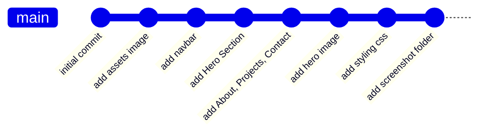

# 🎨 Portfolio Website - Dimas

> **Tugas Akhir Praktikum Pemrograman Web**  
> Topik: Git & Version Control System (VCS)

[](https://developer.mozilla.org/en-US/docs/Web/HTML)
[](https://developer.mozilla.org/en-US/docs/Web/CSS)
[](https://git-scm.com/)

---

## 📋 Deskripsi Project

Portfolio website pribadi yang dibangun menggunakan **HTML5** dan **CSS3** murni. Website ini menampilkan profil, skill, dan project-project yang telah dikerjakan. Project ini dibuat sebagai bagian dari Tugas Akhir Praktikum Pemrograman Web dengan fokus pada penerapan **Git dan Version Control System (VCS)**.

### ✨ Fitur Utama

- 🎯 **Responsive Navigation Bar** - Menu navigasi yang clean dan modern
- 🌟 **Hero Section** - Tampilan pembuka dengan hero image yang menarik
- 👤 **About Section** - Informasi profil dan skill yang dimiliki
- 💼 **Projects Section** - Showcase project-project yang telah dikerjakan
- 📧 **Contact Section** - Link untuk menghubungi via Email dan GitHub
- 🎨 **Modern Design** - UI/UX yang clean dan user-friendly

---

## 🖼️ Preview Website

### Homepage & Hero Section


### About & Projects Section


---

## 📂 Struktur Project

```
prak-pemweb/
├── index.html          # File HTML utama
├── style.css           # Styling website
├── screenshot/         # Folder berisi screenshot preview
│   ├── screenshot-2025-10-30_20-01-59.png
│   └── screenshot-2025-10-30_20-02-20.png
└── README.md          # Dokumentasi project
```

---

## 🚀 Cara Menjalankan

1. **Clone repository ini**

   ```bash
   git clone https://github.com/DimasEPS/TA_praktikum-pemweb-judul2.git
   ```

2. **Masuk ke direktori project**

   ```bash
   cd TA_praktikum-pemweb-judul2
   ```

3. **Buka file `index.html`** di browser favorit Anda
   - Double click file `index.html`, atau
   - Klik kanan > Open with > Browser pilihan Anda

---

## 📝 Git Log - Riwayat Pengembangan

Berikut adalah dokumentasi lengkap proses pengembangan website ini menggunakan Git:

### 🔄 Commit History

| No  | Commit Hash | Pesan Commit                                     | Deskripsi                                                                                                    |
| --- | ----------- | ------------------------------------------------ | ------------------------------------------------------------------------------------------------------------ |
| 7   | `0777850`   | **add scrennshot folder for portofolio preview** | Menambahkan folder screenshot berisi preview tampilan website untuk dokumentasi dan README                   |
| 6   | `0ea7110`   | **add styling css**                              | Implementasi styling lengkap untuk seluruh komponen website (navbar, hero, about, projects, contact, footer) |
| 5   | `1f04dbd`   | **add hero image**                               | Menambahkan hero image untuk membuat tampilan hero section lebih menarik                                     |
| 4   | `f90d0c5`   | **add About, Projects and contact section**      | Membuat struktur HTML untuk section About (profil & skill), Projects (showcase), dan Contact                 |
| 3   | `d7a6a5a`   | **add Hero Section**                             | Membuat Hero Section sebagai landing page dengan greeting dan CTA button                                     |
| 2   | `bfe6eff`   | **add navbar**                                   | Implementasi navigation bar dengan menu Beranda, Tentang, Projects, dan Contact                              |
| 1   | `7442b5f`   | **add assets image**                             | Menambahkan folder assets untuk menyimpan gambar-gambar yang digunakan                                       |
| 0   | `56e3cda`   | **initial commit**                               | Commit pertama - inisialisasi repository dan setup awal project                                              |

### 📊 Workflow Pengembangan



### 🎯 Penjelasan Tahapan Development

#### 1️⃣ **Inisialisasi** (`56e3cda`)

Memulai project dengan setup repository Git dan struktur folder awal.

#### 2️⃣ **Assets Preparation** (`7442b5f`)

Menyiapkan folder assets untuk mengelola gambar dan resource lainnya.

#### 3️⃣ **Navigation Development** (`bfe6eff`)

Membangun komponen navbar sebagai elemen navigasi utama website.

#### 4️⃣ **Hero Section** (`d7a6a5a`)

Membuat landing page dengan hero section yang berisi greeting dan call-to-action.

#### 5️⃣ **Content Sections** (`f90d0c5`)

Menambahkan section-section utama: About (profil), Projects (portfolio), dan Contact.

#### 6️⃣ **Visual Enhancement** (`1f04dbd`)

Menambahkan hero image untuk meningkatkan visual appeal.

#### 7️⃣ **Styling Implementation** (`0ea7110`)

Implementasi CSS lengkap untuk styling seluruh komponen dengan desain modern.

#### 8️⃣ **Documentation** (`0777850`)

Menambahkan screenshot untuk dokumentasi dan keperluan README.

---

## 🛠️ Teknologi yang Digunakan

- **HTML5** - Struktur dan konten website
- **CSS3** - Styling dan layout
- **Git** - Version control system
- **GitHub** - Repository hosting

---

## 💡 Pembelajaran dari Project Ini

Melalui project ini, saya mempelajari dan menerapkan:

✅ **Git Basics**

- `git init` - Inisialisasi repository
- `git add` - Menambahkan file ke staging area
- `git commit` - Menyimpan perubahan dengan pesan deskriptif
- `git log` - Melihat riwayat commit

✅ **Best Practices**

- Membuat commit yang atomic (satu commit = satu fitur/perubahan)
- Menulis commit message yang jelas dan deskriptif
- Mengorganisir file dan folder dengan struktur yang rapi

✅ **Web Development**

- Membuat layout responsive
- Implementasi modern CSS
- Struktur HTML semantik

---

## 👨‍💻 Author

**Dimas Eka Putra Santoso**

- 📧 Email: dimasekaputrasantoso@gmail.com
- 🐙 GitHub: [@DimasEPS](https://github.com/DimasEPS)
- 🎓 Universitas Lampung - Teknik Informatika

---

## 📜 License

Project ini dibuat untuk keperluan akademik (Tugas Akhir Praktikum Pemrograman Web).

---

<div align="center">

**⭐ Jangan lupa untuk memberikan star jika project ini bermanfaat! ⭐**

Made with ❤️ by Dimas

</div>
