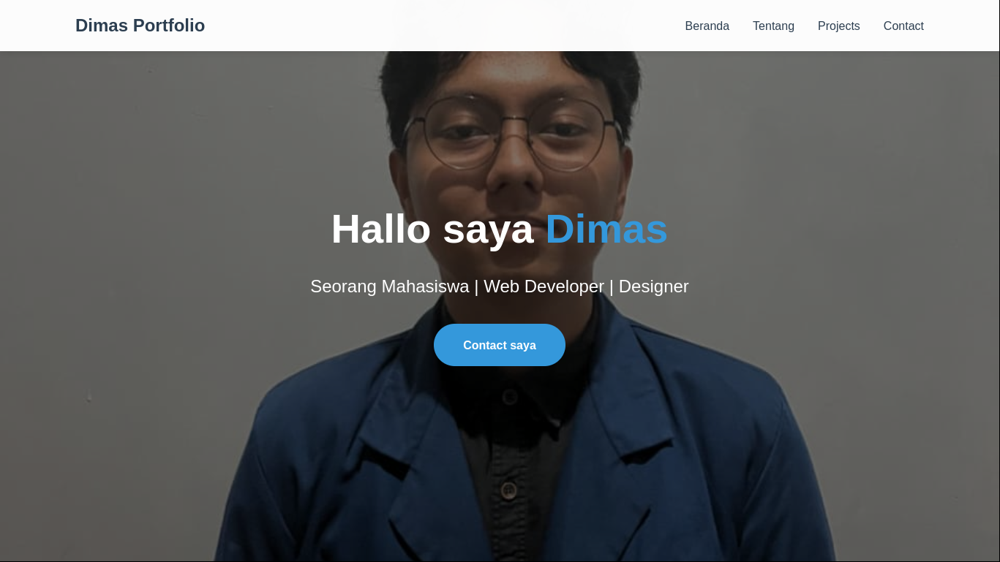
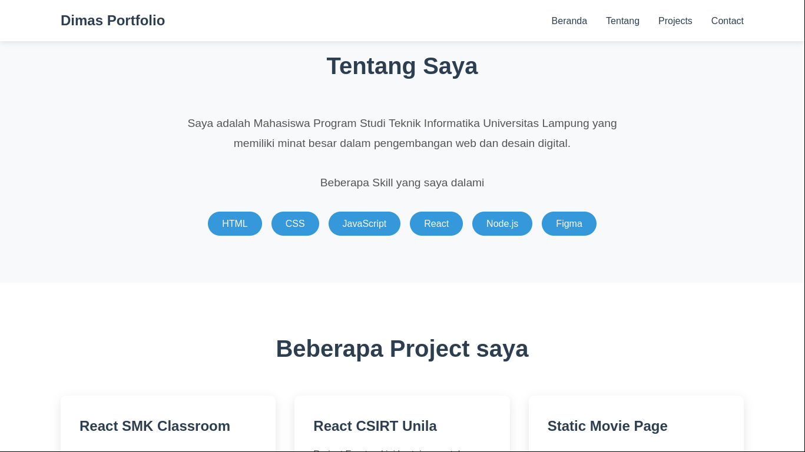
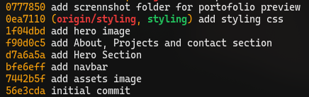

# 🎨 Portfolio Website - Dimas

> **Tugas Akhir Praktikum Pemrograman Web**  
> Topik: Git & Version Control System (VCS)

[](https://developer.mozilla.org/en-US/docs/Web/HTML)
[](https://developer.mozilla.org/en-US/docs/Web/CSS)
[](https://git-scm.com/)

---

## 📋 Tentang Project

Website portfolio pribadi sederhana yang dibuat menggunakan **HTML5** dan **CSS3**. Project ini merupakan Tugas Akhir Praktikum Pemrograman Web dengan fokus pembelajaran **Git dan Version Control System (VCS)**.

**Teknologi:**

- HTML5 untuk struktur halaman
- CSS3 untuk styling dan layout
- Git untuk version control

---

## 🖼️ Preview Website

### Homepage & Hero Section



### About & Projects Section



---

## 📂 Struktur Project

```
prak-pemweb/
├── index.html          # File HTML utama
├── style.css           # Styling website
├── screenshot/         # Folder berisi screenshot preview
│   ├── screenshot-2025-10-30_20-01-59.png
│   └── screenshot-2025-10-30_20-02-20.png
└── README.md          # Dokumentasi project
```

---

## 🚀 Cara Menjalankan

1. **Clone repository ini**

   ```bash
   git clone https://github.com/DimasEPS/TA_praktikum-pemweb-judul2.git
   ```

2. **Masuk ke direktori project**

   ```bash
   cd TA_praktikum-pemweb-judul2
   ```

3. **Buka file `index.html`** di browser favorit Anda
   - Double click file `index.html`, atau
   - Klik kanan > Open with > Browser pilihan Anda

---

## 📝 Git Log & Version Control

Berikut adalah dokumentasi penggunaan Git dalam pengembangan project ini:

### 📊 Git Log



### 🔄 Riwayat Commit

| Commit Hash | Pesan Commit                                 |
| ----------- | -------------------------------------------- |
| `9581844`   | update readme                                |
| `0777850`   | add scrennshot folder for portofolio preview |
| `0ea7110`   | add styling css                              |
| `1f04dbd`   | add hero image                               |
| `f90d0c5`   | add About, Projects and contact section      |
| `d7a6a5a`   | add Hero Section                             |
| `bfe6eff`   | add navbar                                   |
| `7442b5f`   | add assets image                             |
| `56e3cda`   | initial commit                               |

---

## 🌿 Git Branching

Project ini menggunakan 2 branch dalam pengembangannya:

### Branch Structure

```
main (branch utama)
 │
 └─── styling (branch untuk development styling)
```

**Branch `main`:**

- Branch utama yang berisi kode production-ready
- Semua fitur yang sudah selesai di-merge ke branch ini

**Branch `styling`:**

- Branch khusus untuk mengerjakan styling CSS
- Digunakan untuk isolasi pekerjaan styling agar tidak mengganggu branch main
- Setelah styling selesai, di-merge ke branch main

---

## 🔧 Git Commands yang Digunakan

Berikut adalah penjelasan command-command Git yang digunakan selama pengembangan:

### 1. Inisialisasi & Setup

```bash
git init
```

**Fungsi:** Menginisialisasi repository Git baru di folder project

```bash
git config user.name "Nama"
git config user.email "email@example.com"
```

**Fungsi:** Mengatur identitas user untuk commit

### 2. Basic Operations

```bash
git status
```

**Fungsi:** Melihat status perubahan file (modified, staged, untracked)

```bash
git add .
```

**Fungsi:** Menambahkan semua perubahan file ke staging area

```bash
git add namafile
```

**Fungsi:** Menambahkan file tertentu ke staging area

```bash
git commit -m "pesan commit"
```

**Fungsi:** Menyimpan perubahan yang ada di staging area ke repository dengan pesan deskriptif

### 3. Branching & Merging

```bash
git branch
```

**Fungsi:** Melihat daftar branch yang ada dan branch aktif saat ini

```bash
git checkout -b styling
```

**Fungsi:** Membuat branch baru bernama "styling" dan langsung pindah ke branch tersebut

```bash
git checkout main
```

**Fungsi:** Pindah ke branch "main"

```bash
git merge styling
```

**Fungsi:** Menggabungkan perubahan dari branch "styling" ke branch aktif (main)

### 4. History & Logs

```bash
git log
```

**Fungsi:** Melihat riwayat commit lengkap dengan detail author, date, dan hash

```bash
git log --oneline
```

**Fungsi:** Melihat riwayat commit dalam format singkat (satu baris per commit)

```bash
git log --graph
```

**Fungsi:** Melihat riwayat commit dalam bentuk grafik/tree

### 5. Remote Repository

```bash
git remote add origin <url>
```

**Fungsi:** Menghubungkan repository lokal dengan repository remote (GitHub)

```bash
git push origin main
```

**Fungsi:** Mengirim commit dari branch main lokal ke repository remote

```bash
git push origin styling
```

**Fungsi:** Mengirim commit dari branch styling ke repository remote

```bash
git pull
```

**Fungsi:** Mengambil dan menggabungkan perubahan dari repository remote ke lokal

---

## 📜 License

Project ini dibuat untuk keperluan akademik (Tugas Akhir Praktikum Pemrograman Web).

---
